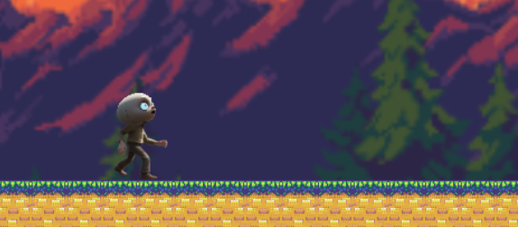

# Bigheaded

[Game Off 2023](https://itch.io/jam/game-off-2023) game jam entry

[Play the game](https://scottyxiii.github.io/bigheaded)

## Development

`npm install` then `npm run dev`

You can press `home` on the keyboard to toggle the debug shapes (dev mode only)

You can drag matter objects in the scene with the mouse or finger when debug mode is enabled (dev mode only)

Trello board: https://trello.com/b/njkSeDet/game-off-2023-bigheaded

[How to use Tiled to edit levels](./Tiled.md)

Choose new material icons here https://fonts.google.com/icons?icon.set=Material+Icons

## Credits

### Tools used

- Phaser
- https://removal.ai/upload
- stable diffusion

### Sounds & Music

- fluffing-a-duck.mp3: https://www.chosic.com/download-audio/27248/
- sneaky-snitch.mp3: https://www.chosic.com/download-audio/39325/
- spook.mp3: https://www.chosic.com/download-audio/45515/
- punch.wav: https://www.chosic.com/
- jump.mp3: https://pixabay.com/sound-effects/toy-button-105724/
- coin.mp3: https://pixabay.com/sound-effects/coin-c-02-102844/

### Parallax artwork

- supermountaindusk and mountain: https://ansimuz.itch.io/mountain-dusk-parallax-background
- blueforest: https://saurabhkgp.itch.io/pixel-art-forest-background-simple-seamless-parallax-ready-for-2d-platformer-s
- forest2022: https://saurabhkgp.itch.io/the-dawn-parallax-background

### Other artwork

- skull: https://pngfre.com/skull-png/skull-png-from-pngfre-33/
- running animation: https://www.youtube.com/watch?v=_1anDiF31OI
