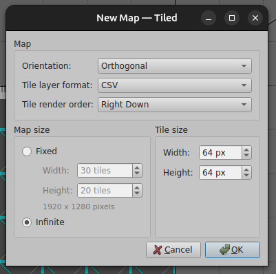
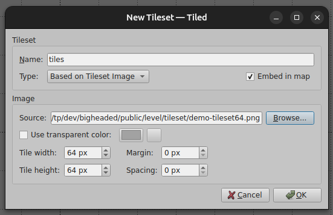

# Using Tiled

## Tiled Map Editor

https://www.mapeditor.org/
https://github.com/mapeditor/tiled

on Linux you may need to:

```sh
sudo apt install libfuse2
chmod +x Tiled-1.10.2_Linux_Qt-6_x86_64.AppImage
./Tiled-1.10.2_Linux_Qt-6_x86_64.AppImage
```

### How to make a new map

in Tiled, select "new map" or CTRL+N, then set the tilesize to match you desired tileset (64x64 in this example)



Then import the tileset with the "New Tileset..." button and change the following:

- Name = tiles
- Embed in map = true
- width and height that matches your chosen tileset



create 3 layers

- `spawner` Object Layer - this holds the markers such as player, goal, bat, tomato, ball, etc
- `staticbody` Object Layer - static bodies must be drawn with polygon tool here
- `solidground` Tile Layer - for drawing the tiles
